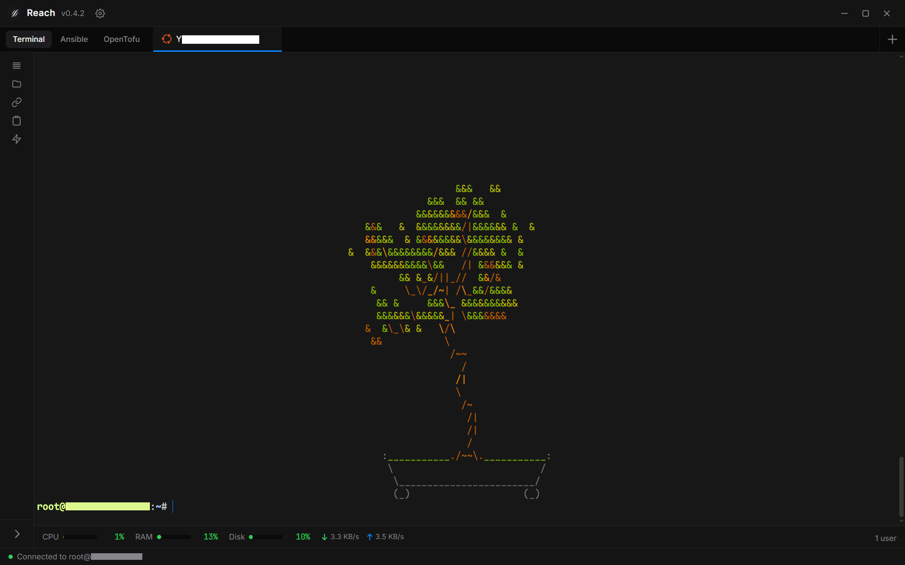
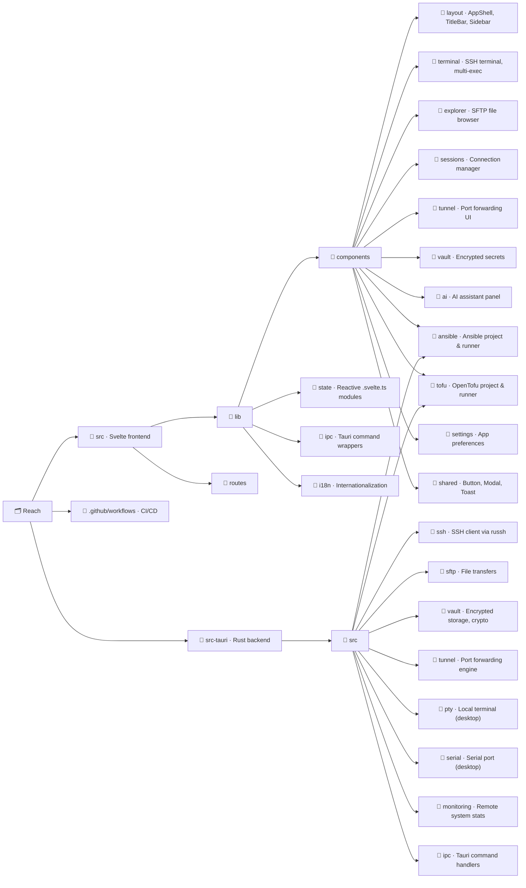

<p align="center">
  
</p>

<h1 align="center">Reach</h1>

<p align="center">
  A modern, cross-platform SSH client and remote management tool.<br>
  Built for engineers who got tired of PuTTY and wanted something that just works.<br>
  <em>This is a personal fork of <a href="https://github.com/alexandrosnt/Reach">Reach</a>. See <a href="#differences-from-upstream">differences from upstream</a> below.</em>
</p>

<p align="center">
  
  
  
</p>

<p align="center">
  &lt; <a href="./README.md">English</a> · <a href="./README.zh-CN.md">简体中文</a> &gt;
</p>

<p align="center">
  <a href="https://alexandrosnt.github.io/Reach/"><strong>Documentation</strong></a> · <a href="https://github.com/CPTProgrammer/ReachQ/issues">Report a Bug</a>
</p>

---

<p align="center">
  
</p>

---

## Why Reach?

Most SSH tools feel like they were designed in 2005, because they were. MobaXterm is Windows-only and bloated, PuTTY hasn't changed in decades, and Termius wants a subscription for basic features.

Reach is what happens when you build an SSH client from scratch with a native UI, proper encryption, and the kind of workflow you'd actually want to use every day. No Electron. No monthly fee. Just a fast, clean tool that runs everywhere.

## Differences from upstream

> _Most code (excluding UI) was generated by AI with human review._

### Terminal

- [x] **Themes** — Configurable terminal themes, including new light themes and more.
- [x] **Fonts** —
  - Disabled Ctrl+Scroll font scaling. Font size is now configurable in settings.
  - Disabled Google Fonts loading. System fonts are now configurable.
  - Font preview now includes CJK samples for checking fullwidth/halfwidth alignment.
- [x] **Selection, copy & paste** —
  - Fixed drag-select accidentally triggering copy. Terminal selection now copies on right-click instead of click.
  - Clipboard operations use Tauri Clipboard Manager plugin (no WebView popup).
  - Multi-line paste shows confirmation dialog to prevent accidental command execution.
- [x] **SSH** —
  - SSH backend buffers output until frontend is ready, preventing MOTD loss.
  - Configurable auto-shell-color with improved injection to handle more edge cases.
  - *Dev: Refactored SSH backend for better code reuse and reduced duplication.*
- [x] Fixed terminal buffer refresh issues when switching between related settings panels.

### UI

- [x] Added Chinese language support with comprehensive UI i18n.
- [x] Various UI refinements.
- [x] Splash screen no longer forces extra 800ms delay. Window can be dragged during splash.
- [x] *Dev: Refactored components for better code reuse and reduced duplication.*

### AI

- [x] Custom Base URL support.
- [ ] Support more AI settings (e.g. reasoning toggle, reasoning effort, etc.).
- [ ] Fix terminal output reading on Windows.
- [ ] Replace LLM command execution with tool calling, add more available tools.
- [ ] Update AI UI to support streaming output, full Markdown, better interaction experience, etc.

### Misc

- [x] Temporarily disabled auto-updates.

## What's inside

### Core

- **SSH Terminal** · Full interactive shell with WebGL rendering. Tabs, split views, and resize that actually works.
- **SFTP File Explorer** · Browse remote filesystems, drag-and-drop transfers, inline editing. Feels like a local file manager.
- **Session Manager** · Save connections with folders and tags. Credentials are encrypted at rest, not stored in plaintext configs.
- **Jump Host (ProxyJump)** · Connect through bastion servers with multi-hop SSH tunneling. Import hosts directly from `~/.ssh/config`.

### Productivity

- **Port Tunneling** · Local, remote, and dynamic SOCKS forwarding. Set it up once, save it with the session.
- **Multi-Exec** · Broadcast the same command to 10 servers at once. Handy for fleet updates.
- **System Monitoring** · Live CPU, memory, and disk stats from connected hosts without installing agents.

### Infrastructure as Code

- **Ansible** · Manage playbooks, inventories, roles, and collections. Run playbooks and ad-hoc commands with streaming output. Encrypts/decrypts files with ansible-vault. On Windows, automatically runs through WSL.
- **OpenTofu** · Plan, apply, and destroy infrastructure. Browse state, manage providers and modules. Full workspace with file editor and streaming command output.

### Extras

- **Serial Console** · Talk to routers, switches, and embedded devices over COM/TTY.
- **AI Assistant** · Optional AI integration for command suggestions and troubleshooting (bring your own API key).
- **Encrypted Vault** · Store secrets, credentials, and SSH keys in an encrypted vault with cloud sync support.
- **Lua Plugins** · Extend Reach with sandboxed Lua scripts. Access SSH, storage, and UI hooks through the host API.
- **Auto-Updates** · The app checks for updates on startup and periodically while running. No manual downloads.

## Tech

Reach is a [Tauri v2](https://v2.tauri.app) app with a Rust backend and Svelte 5 frontend. The entire SSH stack runs natively in Rust through [russh](https://github.com/warp-tech/russh), with no OpenSSH dependency. The UI is rendered in a system webview (not bundled Chromium), so the final binary is small and memory usage stays low.

| | |
|---|---|
| **Backend** | Rust, Tokio, russh |
| **Frontend** | Svelte 5, SvelteKit, TypeScript |
| **Styling** | Tailwind CSS v4 |
| **Terminal** | xterm.js with WebGL addon |
| **Crypto** | XChaCha20-Poly1305, Argon2id, X25519 |
| **Platforms** | Windows, macOS, Linux, Android |

## Getting started

No pre-built releases are available for this fork yet. To use it, build from source.

## Building from source

You'll need [Rust](https://rustup.rs), [Node.js 22+](https://nodejs.org), and the [Tauri prerequisites](https://v2.tauri.app/start/prerequisites/) for your OS.

```bash
git clone https://github.com/CPTProgrammer/ReachQ.git
cd Reach
npm install
npm run tauri dev
```

For a production build:

```bash
npm run tauri build
```

## Project structure



## Changelog

See [CHANGELOG.md](CHANGELOG.md) for the full release history.

## Contributors

Thanks to those who have contributed to Reach:

<table>
  <tr>
    <td align="center">
      <a href="https://github.com/ddwnbot">
        <br />
        <sub><b>ddwnbot</b></sub>
      </a><br />
      <sub>SSH host key verification (TOFU)</sub>
    </td>
    <td align="center">
      <a href="https://github.com/alien-ye">
        <br />
        <sub><b>alien-ye</b></sub>
      </a><br />
      <sub>Click-to-copy terminal selection</sub>
    </td>
  </tr>
</table>

## Contributing

Contributions are welcome. Bug reports, feature ideas, and pull requests all help. If you're picking up a larger feature, open an issue first so we can talk about the approach.

## License
### Licensed under the MIT License.
This project is free software: you are allowed to use, modify, and redistribute it for personal, academic, or commercial purposes under the terms of the MIT license. See the [LICENSE](LICENSE) file for full details.
