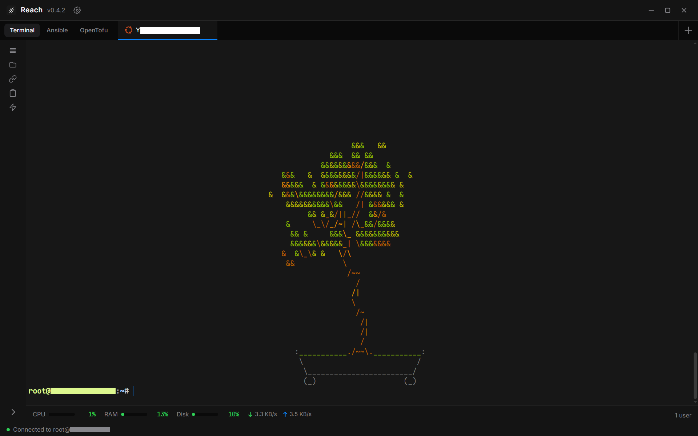
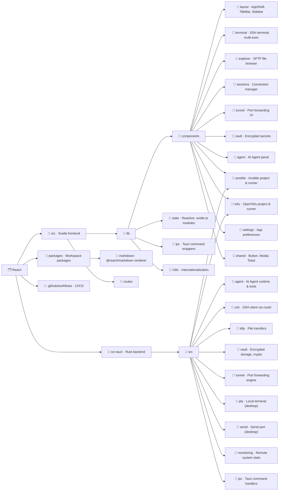

<p align="center">
  
</p>

<h1 align="center">Reach</h1>

<p align="center">
  A modern, cross-platform SSH client and remote management tool.<br>
  Built for engineers who got tired of PuTTY and wanted something that just works.<br>
  <em>This is a personal fork of <a href="https://github.com/alexandrosnt/Reach">Reach</a>. See <a href="#differences-from-upstream">differences from upstream</a> below.</em>
</p>

<p align="center">
  
  
  
</p>

<p align="center">
  &lt; <a href="./README.md">English</a> · <a href="./README.zh-CN.md">简体中文</a> &gt;
</p>

<p align="center">
  <a href="https://alexandrosnt.github.io/Reach/"><strong>Documentation</strong></a> · <a href="https://github.com/CPTProgrammer/ReachQ/issues">Report a Bug</a>
</p>

---

<p align="center">
  
</p>

---

## Why Reach?

Most SSH tools feel like they were designed in 2005, because they were. MobaXterm is Windows-only and bloated, PuTTY hasn't changed in decades, and Termius wants a subscription for basic features.

Reach is what happens when you build an SSH client from scratch with a native UI, proper encryption, and the kind of workflow you'd actually want to use every day. No Electron. No monthly fee. Just a fast, clean tool that runs everywhere.

## Differences from upstream

> _Most code (excluding UI) was generated by AI with human review._

### Terminal

- [x] **Themes** — Configurable terminal themes, including new light themes and more.
- [x] **Fonts** —
  - Disabled Ctrl+Scroll font scaling. Font size is now configurable in settings.
  - Disabled Google Fonts loading. System fonts are now configurable.
  - Font preview now includes CJK samples for checking fullwidth/halfwidth alignment.
- [x] **Selection, copy & paste** —
  - Fixed drag-select accidentally triggering copy. Terminal selection now copies on right-click instead of click.
  - Clipboard operations use Tauri Clipboard Manager plugin (no WebView popup).
  - Multi-line paste shows confirmation dialog to prevent accidental command execution.
- [x] **SSH** —
  - SSH backend buffers output until frontend is ready, preventing MOTD loss.
  - Configurable auto-shell-color with improved injection to handle more edge cases.
  - Prompt user to verify unknown SSH host keys before connecting (TOFU), preventing MITM attacks.
  - *Dev: Refactored SSH backend for better code reuse and reduced duplication.*
- [x] Fixed terminal buffer refresh issues when switching between related settings panels.
- [x] Terminal links open in the system default browser on Ctrl+click (Cmd+click on macOS).

### Editor

- [x] Broader language highlighting with automatic file type detection.
- [x] Smart detection of indentation size and style (spaces vs tabs).
- [x] Full multi-cursor editing support with CJK-aware rectangular selection.

### File Transfer

- [x] **SFTP protocol backend** — Probes the server's SFTP subsystem on connect and caches the session, so file operations no longer depend on the shell. Hosts without SFTP support (e.g. Dropbear) automatically fall back to the original shell exec approach, re-probing on every operation.
- [x] **Transfer performance** — Pipelined transfers: 8 concurrent 255 KiB requests keep the SSH channel window full, replacing the request-response round-trip pattern. Uploads now stream from disk instead of loading the whole file into memory.
- [x] Renaming to an existing destination now raises an error on both backends.
- [x] The file panel's "CD here" now only types the cd command into the terminal without executing it, leaving the user to confirm and press Enter.

### Sessions

- [x] **Host OS detection** — Added Windows host detection and icon. Failed probes now show "Unknown" instead of always falling back to Linux. OS probe timeout reduced from 300s to 10s.
- [x] Session editor can clear cached OS detection results.
- [x] Fixed the connection confirmation dialog: clicking the overlay no longer closes it accidentally, and when cancelled during handshake, late-arriving connections are dropped instead of opening a tab anyway.

### UI

- [x] Added Chinese language support with comprehensive UI i18n.
- [x] Various UI refinements.
- [x] Splash screen no longer forces extra 800ms delay. Window can be dragged during splash.
- [x] Settings dialog's left and right panes scroll independently.
- [x] Default monospace font changed to JetBrains Mono; fixed font preview and dropdown interaction. Content-area monospace font now follows the font setting, with fixed CJK fallback.
- [x] Text and icons on accent-colored backgrounds now use theme-aware contrast colors, fixing readability in light themes.
- [x] Closing the main window now quits the app (prevents hidden editor windows from keeping the process alive).
- [x] *Dev: Refactored components for better code reuse and reduced duplication.*

### AI

The old OpenRouter chat panel has been removed entirely and replaced with a full Agent system (the AI page in Settings is renamed Agent accordingly):

- [x] **Providers & models** — Built-in DeepSeek, Kimi, and OpenRouter presets. Add multiple instances with custom Base URLs. The input box can toggle thinking and reasoning effort per model.
- [x] **Tool calling** — The model operates remote hosts through tools: run terminal commands (executed over SSH, with raw output shown live as terminal cards), read/write/edit files, browse directories (SFTP-based), and fetch web pages.
- [x] **Permission approval** — Each tool can be toggled individually and configured to require approval. Sensitive paths automatically escalate approval. Diffs are shown for confirmation before writing/modifying files. Built-in terminal safety rules that cannot be disabled block dangerous commands like `rm -rf /`.
- [x] **Conversation management** — Conversations persist in a local database, with message edit forking, draft saving, and automatic title generation. Conversations are grouped by their session/connection, so history survives session config changes (proxy, jump host, port). Browse all conversations and migrate them in bulk from Settings.
- [x] **Markdown renderer** — Standalone `@reach/markdown` workspace package: incremental parsing on a patched @lezer/markdown, per-node component tree rendering for streaming partial updates, CommonMark/GFM spec compliance (with spec test suite), built-in XSS filtering and CJK punctuation line-breaking.

### Development

- [x] Added a dev-only component preview route (/preview) with an icon overview and an Agent panel wired to a mock backend, allowing debugging without a real API.

### Misc

- [x] Temporarily disabled auto-updates.
- [ ] _**(Dev) Known issue:** During SSH host key verification, the `ssh_manager` Mutex is held while waiting for user input, which blocks unrelated SSH operations (`ssh_send`, `ssh_resize`, `ssh_disconnect`, etc.) on other connections. Incoming terminal data is unaffected (emitted directly from the session task via Tauri events, no lock needed). Should be refactored to release the lock before awaiting the oneshot response._

## What's inside

### Core

- **SSH Terminal** · Full interactive shell with WebGL rendering. Tabs, split views, and resize that actually works.
- **SFTP File Explorer** · Browse remote filesystems, drag-and-drop transfers, inline editing. Feels like a local file manager.
- **Session Manager** · Save connections with folders and tags. Credentials are encrypted at rest, not stored in plaintext configs.
- **Jump Host (ProxyJump)** · Connect through bastion servers with multi-hop SSH tunneling. Import hosts directly from `~/.ssh/config`.

### Productivity

- **Port Tunneling** · Local, remote, and dynamic SOCKS forwarding. Set it up once, save it with the session.
- **Multi-Exec** · Broadcast the same command to 10 servers at once. Handy for fleet updates.
- **System Monitoring** · Live CPU, memory, and disk stats from connected hosts without installing agents.

### Infrastructure as Code

- **Ansible** · Manage playbooks, inventories, roles, and collections. Run playbooks and ad-hoc commands with streaming output. Encrypts/decrypts files with ansible-vault. On Windows, automatically runs through WSL.
- **OpenTofu** · Plan, apply, and destroy infrastructure. Browse state, manage providers and modules. Full workspace with file editor and streaming command output.

### Extras

- **Serial Console** · Talk to routers, switches, and embedded devices over COM/TTY.
- **AI Agent** · Optional AI integration with multi-provider support. The model can run commands and read/write files directly on remote hosts through approval-gated tools (bring your own API key).
- **Encrypted Vault** · Store secrets, credentials, and SSH keys in an encrypted vault with cloud sync support.
- **Lua Plugins** · Extend Reach with sandboxed Lua scripts. Access SSH, storage, and UI hooks through the host API.
- **Auto-Updates** · The app checks for updates on startup and periodically while running. No manual downloads.

## Tech

Reach is a [Tauri v2](https://v2.tauri.app) app with a Rust backend and Svelte 5 frontend. The entire SSH stack runs natively in Rust through [russh](https://github.com/warp-tech/russh), with no OpenSSH dependency. The UI is rendered in a system webview (not bundled Chromium), so the final binary is small and memory usage stays low.

| | |
|---|---|
| **Backend** | Rust, Tokio, russh |
| **Frontend** | Svelte 5, SvelteKit, TypeScript |
| **Styling** | Tailwind CSS v4 |
| **Terminal** | xterm.js with WebGL addon |
| **Crypto** | XChaCha20-Poly1305, Argon2id, X25519 |
| **Platforms** | Windows, macOS, Linux, Android |

## Getting started

No pre-built releases are available for this fork yet. To use it, build from source.

## Building from source

You'll need [Rust](https://rustup.rs), [Node.js 22+](https://nodejs.org), and the [Tauri prerequisites](https://v2.tauri.app/start/prerequisites/) for your OS.

```bash
git clone https://github.com/CPTProgrammer/ReachQ.git
cd Reach
npm install
npm run tauri dev
```

For a production build:

```bash
npm run tauri build
```

## Project structure


```mermaid
graph LR
  root["🗂 Reach"]

  root --> src["📁 src · Svelte frontend"]
  root --> tauri["📁 src-tauri · Rust backend"]
  root --> pkgs["📁 packages · Workspace packages"]
  root --> gh["📁 .github/workflows · CI/CD"]

  pkgs --> md["📄 markdown · @reach/markdown renderer"]

  src --> routes["📄 routes"]
  src --> lib["📁 lib"]

  lib --> components["📁 components"]
  lib --> state["📄 state · Reactive .svelte.ts modules"]
  lib --> ipc["📄 ipc · Tauri command wrappers"]
  lib --> i18n["📄 i18n · Internationalization"]

  components --> layout["📄 layout · AppShell, TitleBar, Sidebar"]
  components --> terminal["📄 terminal · SSH terminal, multi-exec"]
  components --> explorer["📄 explorer · SFTP file browser"]
  components --> sessions["📄 sessions · Connection manager"]
  components --> tunnel["📄 tunnel · Port forwarding UI"]
  components --> vault["📄 vault · Encrypted secrets"]
  components --> agent["📄 agent · AI Agent panel"]
  components --> ansible["📄 ansible · Ansible automation"]
  components --> tofu["📄 tofu · OpenTofu IaC"]
  components --> settings["📄 settings · App preferences"]
  components --> shared["📄 shared · Button, Modal, Toast"]

  tauri --> taurisrc["📁 src"]
  taurisrc --> agentbe["📄 agent · AI Agent runtime & tools"]
  taurisrc --> ssh["📄 ssh · SSH client via russh"]
  taurisrc --> sftp["📄 sftp · File transfers"]
  taurisrc --> tvault["📄 vault · Encrypted storage, crypto"]
  taurisrc --> ttunnel["📄 tunnel · Port forwarding engine"]
  taurisrc --> pty["📄 pty · Local terminal (desktop)"]
  taurisrc --> serial["📄 serial · Serial port (desktop)"]
  taurisrc --> monitoring["📄 monitoring · Remote system stats"]
  taurisrc --> ansible["📄 ansible · Ansible project & runner"]
  taurisrc --> tofu["📄 tofu · OpenTofu project & runner"]
  taurisrc --> tipc["📄 ipc · Tauri command handlers"]
```

## Changelog

See [CHANGELOG.md](CHANGELOG.md) for the full release history.

## Contributors

Thanks to those who have contributed to Reach:

<table>
  <tr>
    <td align="center">
      <a href="https://github.com/ddwnbot">
        <br />
        <sub><b>ddwnbot</b></sub>
      </a><br />
      <sub>SSH host key verification (TOFU)</sub>
    </td>
    <td align="center">
      <a href="https://github.com/alien-ye">
        <br />
        <sub><b>alien-ye</b></sub>
      </a><br />
      <sub>Click-to-copy terminal selection</sub>
    </td>
  </tr>
</table>

## Contributing

Contributions are welcome. Bug reports, feature ideas, and pull requests all help. If you're picking up a larger feature, open an issue first so we can talk about the approach.

## License
### Licensed under the MIT License.
This project is free software: you are allowed to use, modify, and redistribute it for personal, academic, or commercial purposes under the terms of the MIT license. See the [LICENSE](LICENSE) file for full details.
