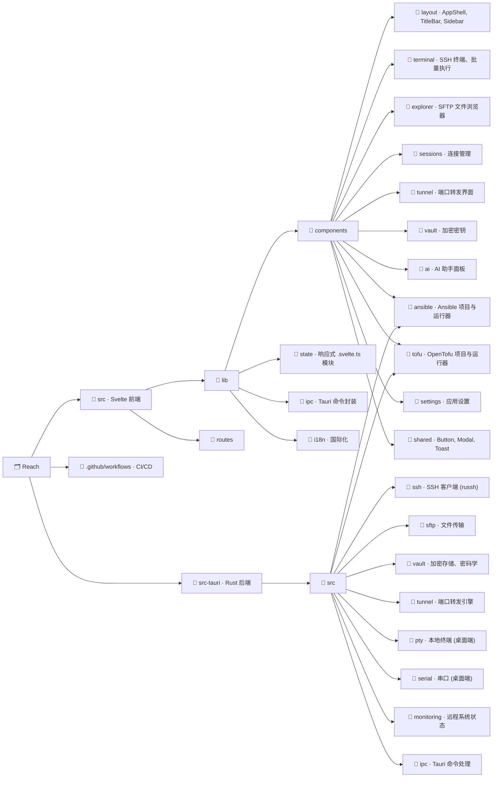

<p align="center">
  
</p>

<h1 align="center">Reach</h1>

<p align="center">
  一个现代、跨平台的 SSH 客户端和远程管理工具。<br>
  为厌倦了 PuTTY、想要一个开箱即用的工具的工程师而打造。<br>
  <em>这是 <a href="https://github.com/alexandrosnt/Reach">Reach</a> 的个人 fork。见下方<a href="#与原项目的区别">与原项目的区别</a>。</em>
</p>

<p align="center">
  
  
  
</p>

<p align="center">
  &lt; <a href="./README.md">English</a> · <a href="./README.zh-CN.md">简体中文</a> &gt;
</p>

<p align="center">
  <a href="https://alexandrosnt.github.io/Reach/"><strong>文档</strong></a> · <a href="https://github.com/CPTProgrammer/ReachQ/issues">报告 Bug</a>
</p>

---

<p align="center">
  
</p>

---

## 为什么选择 Reach？

大多数 SSH 工具用起来像是 2005 年的产物，因为它们确实是。MobaXterm 仅限 Windows 且臃肿，PuTTY 几十年没变过，Termius 连基础功能都要订阅。

Reach 是从零开始打造的 SSH 客户端：原生 UI，真正的加密，以及你每天都愿意用的工作流。没有 Electron，没有月费。只是一个快速、清爽、到处都能跑的工具。

## 与原项目的区别

>  _除 UI 外的绝大多数代码由AI编写+人工检查_

### 终端

- [x] **主题** — 允许配置终端主题，并新增亮色主题等
- [x] **字体** —
  - 禁用了 Ctrl+滚轮 缩放字体大小，改为设置窗口内配置
  - 禁用了谷歌字体加载，并允许配置系统字体
  - 字体预览新增中文样本，以检查字体全角半角对齐情况
- [x] **文本选择、复制与粘贴** —
  - 修复拖拽选择文本时意外触发复制的 bug，且终端选中文本从点击复制改为右键复制
  - 使用 Tauri Clipboard Manager 插件来复制粘贴，不会有 WebView 弹窗
  - 粘贴多行内容时弹出确认对话框，防止意外执行多行命令
- [x] **SSH** —
  - 开启 SSH 会话时后端先缓存数据，等前端准备好再一并发送，防止 MOTD 被吞掉
  - 允许配置是否开启自动着色 Shell，优化了注入命令和方式，能处理更多边界条件
  - 连接前弹出未知 SSH 主机密钥供用户验证 (TOFU)，防止中间人攻击
  - *开发：重构了 SSH 后端逻辑，增加代码复用，减少重复代码*
- [x] 修复终端在相关界面设置切换后刷新缓冲区的问题
- [x] 按住 Ctrl（macOS 为 Cmd）点击终端中的 URL可以在系统默认浏览器中打开链接

### 编辑器

- [X] 更多语言高亮
- [X] 智能检测缩进大小与类型

### 界面

- [x] 新增中文语言，并补充了更全的界面 i18n
- [x] 优化了一些界面细节
- [x] 预加载界面不再强制多显示 800ms，并且可以在预加载界面拖拽窗口
- [x] *开发：重构部分组件，增加代码复用，减少重复代码*

### AI

- [x] 支持自定义 Base URL
- [ ] 支持更多 AI 设置（如是否开启推理、推理强度等）
- [ ] 修复 Windows 下读取终端输出问题
- [ ] 将 LLM 运行命令的方式换为 Tool Call，增加更多可用工具
- [ ] 更新 AI 界面，以支持流式输出、完整 Markdown、更优的交互体验等

### 其他

- [x] 暂时禁用了自动更新
- [ ] _**（开发）已知问题：** SSH 主机密钥验证期间，`ssh_manager` Mutex 在等待用户输入时持续持有，会阻塞其他连接上的无关 SSH 操作（`ssh_send`、`ssh_resize`、`ssh_disconnect` 等）。终端数据的接收不受影响（由 session task 直接通过 Tauri 事件发出，不依赖该锁）。日后应重构为在等待 oneshot 响应前释放锁。_

## 功能一览

### 核心功能

- **SSH 终端** · 全交互式 Shell，WebGL 渲染。支持标签页、分屏、可正确响应窗口缩放。
- **SFTP 文件浏览器** · 浏览远程文件系统，支持拖拽传输、在线编辑。操作体验如同本地文件管理器。
- **会话管理** · 用文件夹和标签管理连接。凭据加密存储，不会以明文写入配置文件。
- **跳板机 (ProxyJump)** · 通过堡垒服务器多跳 SSH 连接。可直接从 `~/.ssh/config` 导入主机。

### 效率工具

- **端口转发** · 本地、远程和动态 SOCKS 转发。配置一次，随会话保存。
- **批量执行** · 同时向多台服务器广播相同命令，便于集群维护。
- **系统监控** · 无需安装额外工具，实时查看已连接主机的 CPU、内存和磁盘状态。

### 基础设施即代码

- **Ansible** · 管理 Playbook、Inventory、Role 和 Collection。运行 Playbook 和临时命令，支持流式输出。集成 ansible-vault 加解密功能。Windows 下自动通过 WSL 运行。
- **OpenTofu** · 执行 plan、apply 和 destroy 操作。浏览状态文件，管理 Provider 和 Module。完整的编辑器工作区，支持流式命令输出。

### 其他功能

- **串口控制台** · 通过 COM/TTY 与路由器、交换机和嵌入式设备通信。
- **AI 助手** · 可选的 AI 集成，提供命令建议和故障排除（需自备 API Key）。
- **加密保险库** · 将密钥、凭据和 SSH Key 存储在加密保险库中，支持云端同步。
- **Lua 插件** · 用沙箱化的 Lua 脚本扩展 Reach。通过 Host API 访问 SSH、存储和 UI Hook。
- **自动更新** · 应用在启动时及运行期间定期检查更新，无需手动下载。

## 技术栈

Reach 是一个 [Tauri v2](https://v2.tauri.app) 应用，后端使用 Rust，前端使用 Svelte 5。整个 SSH 栈通过 [russh](https://github.com/warp-tech/russh) 在 Rust 中原生运行，不依赖 OpenSSH。UI 渲染在系统 WebView 中（而非内置 Chromium），因此最终二进制体积小、内存占用低。

| | |
|---|---|
| **后端** | Rust, Tokio, russh |
| **前端** | Svelte 5, SvelteKit, TypeScript |
| **样式** | Tailwind CSS v4 |
| **终端** | xterm.js 配合 WebGL 插件 |
| **加密** | XChaCha20-Poly1305, Argon2id, X25519 |
| **平台** | Windows, macOS, Linux, Android |

## 快速开始

此 fork 暂无预编译的发布版本。如需使用，请从源码构建。

## 从源码构建

你需要安装 [Rust](https://rustup.rs)、[Node.js 22+](https://nodejs.org)，以及对应操作系统的 [Tauri 前置依赖](https://v2.tauri.app/start/prerequisites/)。

```bash
git clone https://github.com/CPTProgrammer/ReachQ.git
cd Reach
npm install
npm run tauri dev
```

生产环境构建：

```bash
npm run tauri build
```

## 项目结构



## 更新日志

完整发布历史见 [CHANGELOG.md](CHANGELOG.md)。

## 贡献者

感谢以下 Reach 贡献者：

<table>
  <tr>
    <td align="center">
      <a href="https://github.com/ddwnbot">
        <br />
        <sub><b>ddwnbot</b></sub>
      </a><br />
      <sub>SSH 主机密钥验证 (TOFU)</sub>
    </td>
    <td align="center">
      <a href="https://github.com/alien-ye">
        <br />
        <sub><b>alien-ye</b></sub>
      </a><br />
      <sub>终端点击选中并复制</sub>
    </td>
  </tr>
</table>

## 参与贡献

欢迎贡献。Bug 报告、功能建议和 Pull Request 都很有帮助。如果你想做较大的功能改动，请先开 Issue 讨论方案。

## 许可证
### 基于 MIT 许可证授权
本项目是自由软件：你可以根据 MIT 许可证的条款，将其用于个人、学术或商业目的，自由使用、修改和再分发。完整条款见 [LICENSE](LICENSE) 文件。
